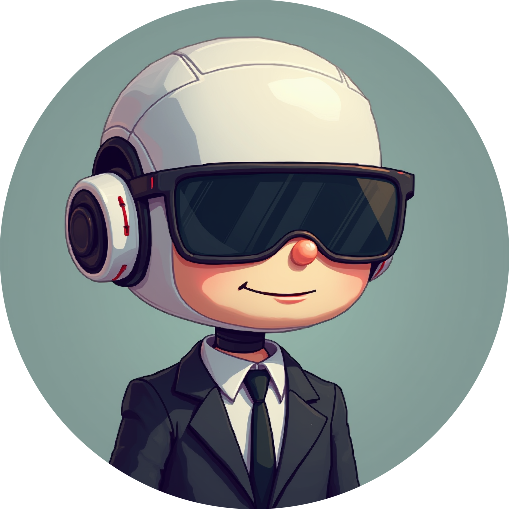
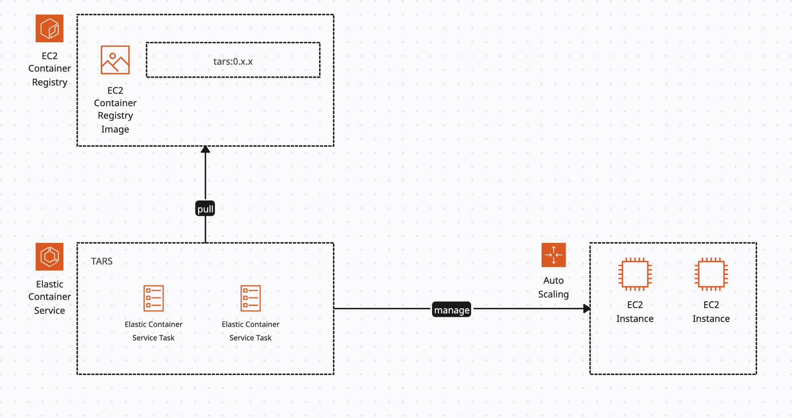

<!--  -->

<h1 align="center">
TARS
</h1>

<strong>(Telegram Assistant to Remind me Stuffs)</strong>

<strong>A telegram bot with AI agent running behind to set reminders in natural language</strong>

 
 
Since I use telegram as the main source of communication tool with my colleagues, friends and family, telegram is always up and running on all my IT devices. So, setting reminders and scheduling later events and getting them as telegram messages is pretty convenient to me. That's why I created this bot.
 
And btw, TARS is also the name of the beloved sarcastic and humorous robot from Interstellar ;)
 

<video width="200" height="500" src="https://github.com/user-attachments/assets/295eecd9-cca0-45c6-8d59-44a67b49de65" controls></video>

 

<h2>Features</h2>
- Natural language interface
- Photos and documents upload

 

<h2>Deployment</h2>
- AWS ECS
- AWS ASG

